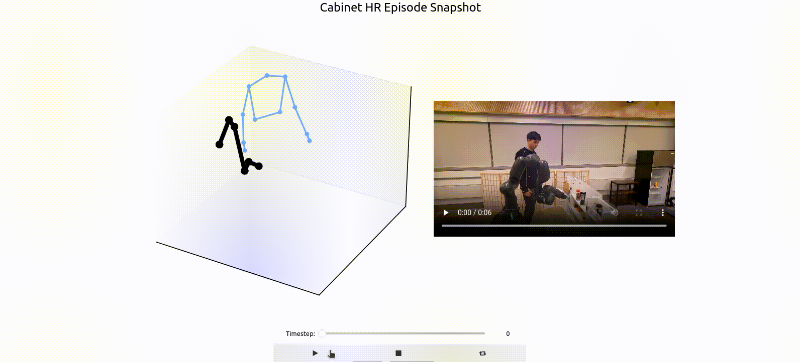

# Collaborative Manipulation Dataset (CoMaD)

The CoMaD dataset is a collection of human-human and human-robot interactions in collaborative kitchen activities. We release 5 different long-horizon activities (Reactive Stirring, Cart Place, Table Setting, Cabinet Arrange, and, Object Handovers).

The dataset contains multiple episodes of human-human and human-robot teams performing each activity. There are over 15 unique users across our dataset collaborating with a Franka Emika Research 3 robot arm.

We release a high-quality dataset collected using a motion capture system, consisting of:
- 488 human-human episodes (~6 hours of motion)
- 304 human-robot episodes (~1 hour of motion)

Each episode contains the following data:
- Motion Capture of 24 upper body joints of the human
- Robot Arm Joint Positions (for Human-Robot teams)
- Third-person RGB camera view

Motion capture and joint positions are collected at a frequency of 120Hz, while the camera records images at 30Hz.

 <table border="0">
 <tr align="center">
    <td>
</tr>
</table>

<!-- ### Human-Human Interactions

<table border="0">
 <tr align="center">
    <td>
    <em>Object Handover</em></td>
</tr>
    <tr align="center">
    <td>
    <em>Reactive Stirring</em></td>
</tr>
    <tr align="center">
    <td>
    <em>Collaborative Table Setting</em></td>
</tr>
</tr>
    <tr align="center">
    <td>
    <em>Cabinet Arrange</em></td>
</tr>
</tr>
    <tr align="center">
    <td>
    <em>Cart Pick</em></td>
</tr>
</table>

### Human-Robot Interactions

<table border="0">
 <tr align="center">
    <td>
    <em>Object Handover</em></td>
</tr>
    <tr align="center">
    <td>
    <em>Reactive Stirring</em></td>
</tr>
    <tr align="center">
    <td>
    <em>Collaborative Table Setting</em></td>
</tr>
</tr>
    <tr align="center">
    <td>
    <em>Cabinet Arrange</em></td>
</tr>
</tr>
    <tr align="center">
    <td>
    <em>Cart Pick</em></td>
</tr>
</table> -->

### Setup

Please download the remaining components for the dataset from this link: [CoMaD](https://cornell.box.com/s/jb0wau30dqotcjsak78ks64ea1o88yan). This includes the folders for the corresponding videos for the json files in the github repo.

After downloading, maintain the following file structure to facilitate splitting model training into training and validation sets.
```
├── train
├── test
```
First create a new conda environment with python=3.9 and run the below command
``` 
pip install -r requirements.txt 
```

Then activate ipywidgets

``` 
jupyter nbextension enable --py widgetsnbextension 
```

### Visualization and Features

Play any data episode through Python notebook: ```scripts/comad_visualization.ipynb```.

In the notebook, the user can load a matplotlib viz of every episode that can either be paired with the corresponding RGB video or a slideshow of images from the RGB video that are aligned by timestep.

<table border="0">
 <tr align="center">
    <td>
    <em>RGB Video</em></td>
</tr>
    <tr align="center">
    <td>
    <em>Image Slideshow</em></td>
</tr>
</table>

### BibTeX
Please consider citing our papers where we develop collaborative robots using the CoMaD dataset:

```bibtex
@inproceedings{Kedia2023ManiCastCM,
  title={ManiCast: Collaborative Manipulation with Cost-Aware Human Forecasting},
  author={K. Kedia and Prithwish Dan and Atiksh Bhardwaj and Sanjiban Choudhury},
  booktitle={Conference on Robot Learning},
  year={2023},
}
```

```bibtex
@inproceedings{Kedia2023InteRACTTM,
  title={InteRACT: Transformer Models for Human Intent Prediction Conditioned on Robot Actions},
  author={K. Kedia and Atiksh Bhardwaj and Prithwish Dan and Sanjiban Choudhury},
  journal={2024 IEEE International Conference on Robotics and Automation (ICRA)},
  year={2024},
  pages={621-628},
}
```

```bibtex
@article{Wang2024MOSAICAM,
  title={MOSAIC: A Modular System for Assistive and Interactive Cooking},
  author={Huaxiaoyue Wang and K. Kedia and Juntao Ren and Rahma Abdullah and Atiksh Bhardwaj and Angela Chao and Kelly Y Chen and Nathaniel Chin and Prithwish Dan and Xinyi Fan and Gonzalo Gonzalez-Pumariega and Aditya Kompella and Maximus Adrian Pace and Yash Sharma and Xiangwan Sun and Neha Sunkara and Sanjiban Choudhury},
  journal={ArXiv},
  year={2024},
  volume={abs/2402.18796},
}
```
