# Collaborative Manipulation Dataset (CoMaD)

The CoMaD dataset captures human-human and human-robot interactions in collaborative kitchen tasks. It includes five long-horizon activities: Reactive Stirring, Cart Place, Table Setting, Cabinet Arrange, and Object Handovers.

The dataset features 14+ unique users working with a Franka Emika Research 3 robot arm across:

    488 human-human episodes (~6 hours of motion)
    304 human-robot episodes (~1 hour of motion)

Each episode includes:

    24 upper-body human motion capture points
    Robot arm joint positions (for human-robot teams)
    Third-person RGB camera footage

Motion data is recorded at 120Hz, and video at 30Hz.

 <table border="0">
 <tr align="center">
    <td>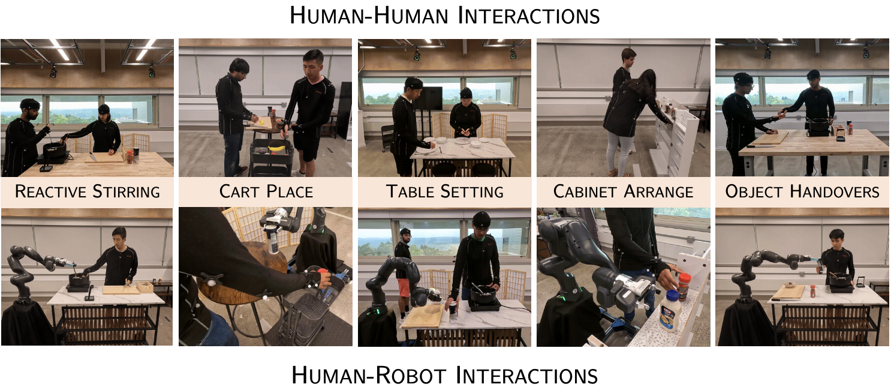
</tr>
</table>

<!-- ### Human-Human Interactions

<table border="0">
 <tr align="center">
    <td>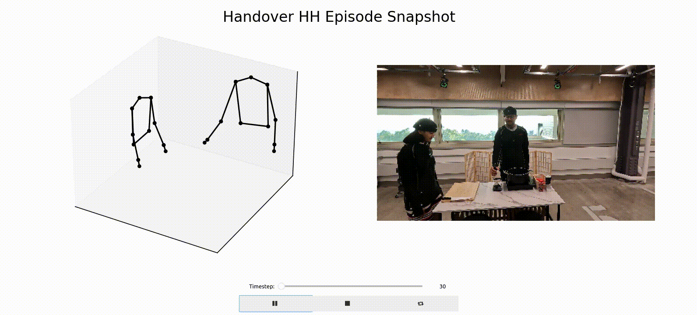
    <em>Object Handover</em></td>
</tr>
    <tr align="center">
    <td>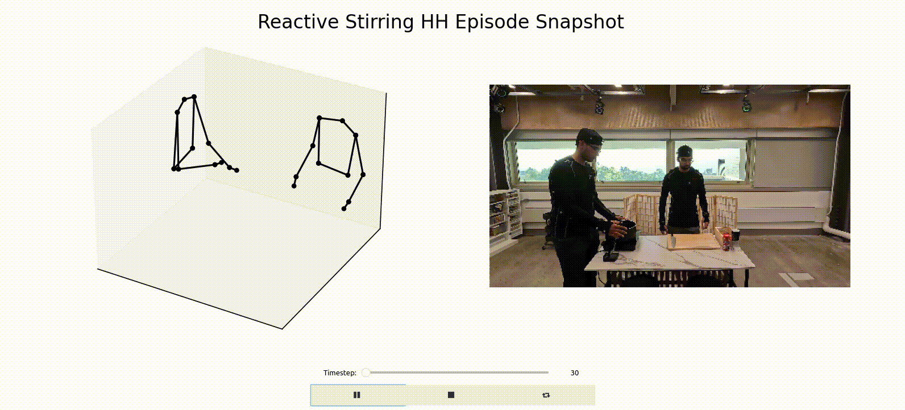
    <em>Reactive Stirring</em></td>
</tr>
    <tr align="center">
    <td>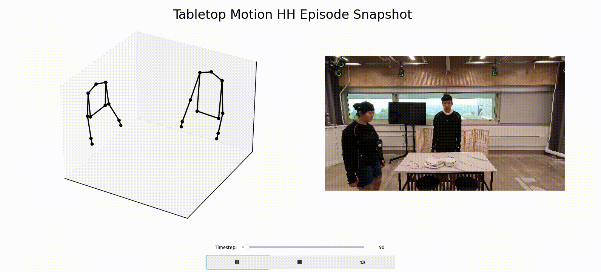
    <em>Collaborative Table Setting</em></td>
</tr>
</tr>
    <tr align="center">
    <td>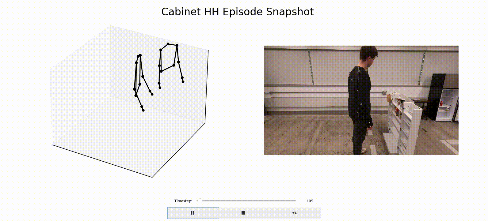
    <em>Cabinet Arrange</em></td>
</tr>
</tr>
    <tr align="center">
    <td>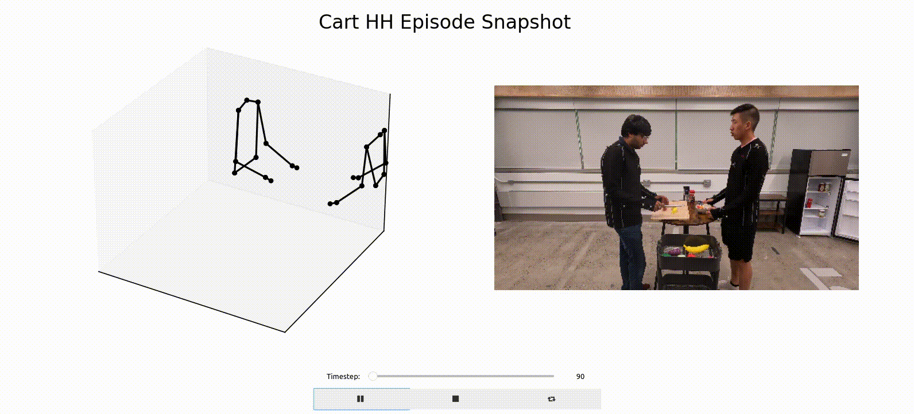
    <em>Cart Pick</em></td>
</tr>
</table>

### Human-Robot Interactions

<table border="0">
 <tr align="center">
    <td>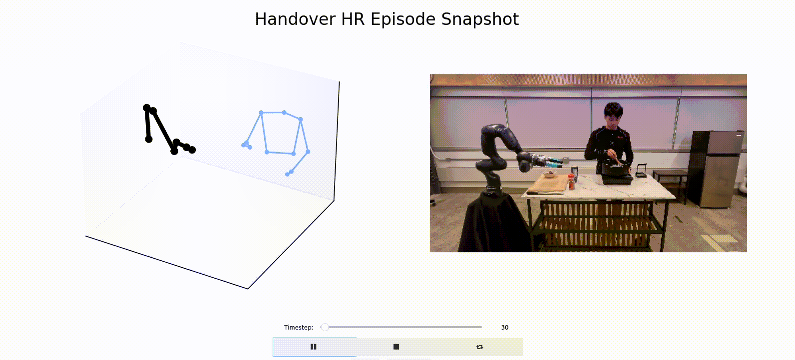
    <em>Object Handover</em></td>
</tr>
    <tr align="center">
    <td>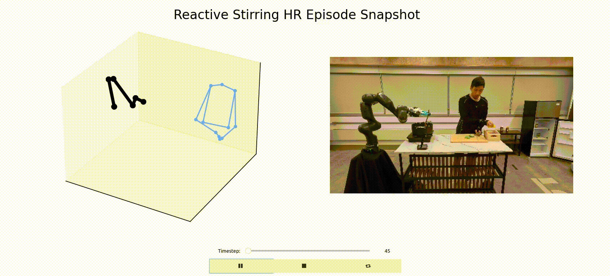
    <em>Reactive Stirring</em></td>
</tr>
    <tr align="center">
    <td>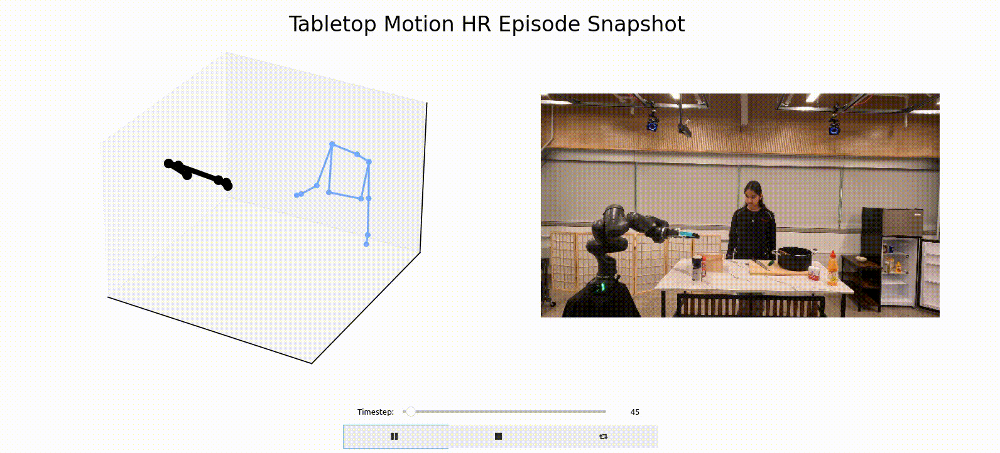
    <em>Collaborative Table Setting</em></td>
</tr>
</tr>
    <tr align="center">
    <td>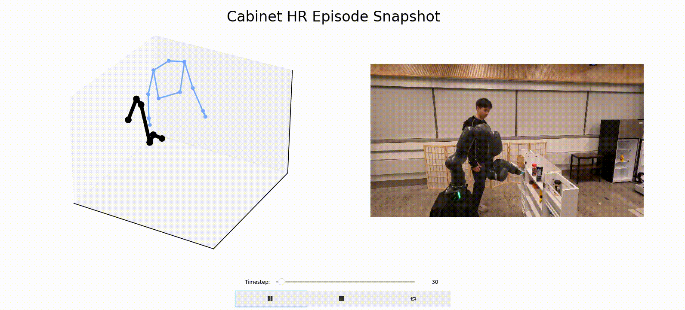
    <em>Cabinet Arrange</em></td>
</tr>
</tr>
    <tr align="center">
    <td>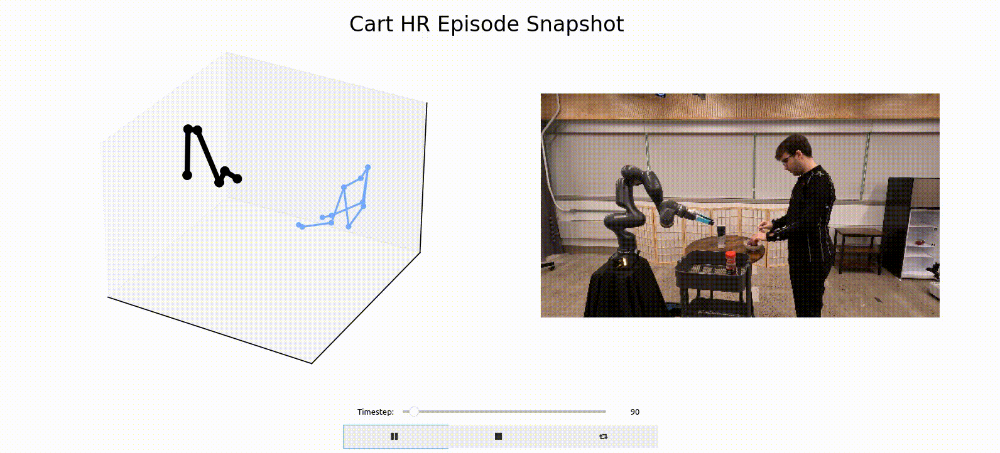
    <em>Cart Pick</em></td>
</tr>
</table> -->

### Setup

Download the data from this link [Data](https://cornell.app.box.com/s/jb0wau30dqotcjsak78ks64ea1o88yan) into the correct data directory.

You can download the .zip file and extract the data using the following terminal commands:
```
wget https://cornell.box.com/shared/static/6ss0mfojdof8q1z9ru7go58rwxqbnel5.zip -O comad_data.zip
unzip comad_data.zip -d .
rm comad_data.zip
```
Follow these steps to install `CoMaD`:

1. Create and activate the conda environment:
   ```bash
   cd interact
   conda create --name comad python=3.9
   conda activate comad
   pip install -r requirements.txt
   jupyter nbextension enable --py widgetsnbextension 
   ```

### Visualization and Features

Play any data episode through Python notebook: ```scripts/comad_visualization.ipynb```.

In the notebook, the user can load a matplotlib viz of every episode that can either be paired with the corresponding slideshow of images from the RGB video that are aligned by timestep.

<table border="0">
    <tr align="center">
    <td>
    <em>Image Slideshow</em></td>
</tr>
</table>

### BibTeX
Please consider citing our papers where we develop collaborative robots using the CoMaD dataset:

```bibtex
@inproceedings{Kedia2023ManiCastCM,
  title={ManiCast: Collaborative Manipulation with Cost-Aware Human Forecasting},
  author={K. Kedia and Prithwish Dan and Atiksh Bhardwaj and Sanjiban Choudhury},
  booktitle={Conference on Robot Learning},
  year={2023},
}
```

```bibtex
@inproceedings{Kedia2023InteRACTTM,
  title={InteRACT: Transformer Models for Human Intent Prediction Conditioned on Robot Actions},
  author={K. Kedia and Atiksh Bhardwaj and Prithwish Dan and Sanjiban Choudhury},
  journal={2024 IEEE International Conference on Robotics and Automation (ICRA)},
  year={2024},
  pages={621-628},
}
```

```bibtex
@article{Wang2024MOSAICAM,
  title={MOSAIC: A Modular System for Assistive and Interactive Cooking},
  author={Huaxiaoyue Wang and K. Kedia and Juntao Ren and Rahma Abdullah and Atiksh Bhardwaj and Angela Chao and Kelly Y Chen and Nathaniel Chin and Prithwish Dan and Xinyi Fan and Gonzalo Gonzalez-Pumariega and Aditya Kompella and Maximus Adrian Pace and Yash Sharma and Xiangwan Sun and Neha Sunkara and Sanjiban Choudhury},
  journal={ArXiv},
  year={2024},
  volume={abs/2402.18796},
}
```
